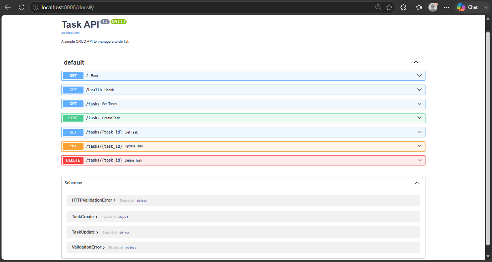

# Task API

A simple CRUD API to manage a to-do list, built with FastAPI. Data is stored in memory (no database) and resets when the server restarts.

## How to run

1. Clone this repo and enter the folder
2. Create and activate a virtual environment:
```
   python -m venv venv
   venv\Scripts\activate
```
3. Install dependencies:
```
   pip install fastapi uvicorn
```
4. Start the server:
```
   uvicorn main:app --reload
```
5. Open `http://localhost:8000/docs` to explore the API

## Endpoints

| Method | Path | Description |
|---|---|---|
| GET | / | Basic info about the API |
| GET | /health | Health check |
| GET | /tasks | List all tasks |
| GET | /tasks/{id} | Get a single task |
| POST | /tasks | Create a new task |
| PUT | /tasks/{id} | Update a task |
| DELETE | /tasks/{id} | Delete a task |

## Example request

```
HTTP/1.1 200 OK
date: Fri, 17 Jul 2026 22:44:36 GMT
server: uvicorn
content-length: 105
content-type: application/json

[{"id":1,"title":"Buy milk and eggs","done":true},{"id":3,"title":"Finish CRUD assignment","done":false}]
```

## Swagger UI



## Running with Docker (recommended)

This is now the primary way to run the project — a single command starts both the API and the database:

1. Clone this repo
2. Copy `.env.example` to `.env` and adjust values if needed:
```
   cp .env.example .env
```
3. Start everything:
```
   docker compose up -d --build
```
4. Open `http://localhost:8000/docs`

To stop: `docker compose down` (add `-v` only if you want to wipe the database volume too — this deletes all data).

## Database

Postgres runs in its own container with a named volume (`pgdata`), so data survives container restarts and `docker compose down` (without `-v`).

Schema (`schema.sql`):
```sql
CREATE TABLE IF NOT EXISTS tasks (
    id SERIAL PRIMARY KEY,
    title TEXT NOT NULL,
    done BOOLEAN NOT NULL DEFAULT FALSE
);
```

The schema is auto-applied on first startup via Postgres' `docker-entrypoint-initdb.d` mechanism.

## Persistence proof

Tested by: creating 3 tasks via Swagger, then running `docker compose down` followed by `docker compose up -d --build` (a full stack teardown and rebuild, not just a restart). All 3 tasks were still present in `GET /tasks` afterward — confirming the volume persists data independently of the container's lifecycle.

## Architecture note

The API used an in-memory list in Week 2. This week, storage was swapped to a real Postgres-backed repository (`PostgresTaskRepository` in `repository.py`) behind the same `TaskRepository` interface. Routes and business logic in `main.py` did not change — only which repository gets instantiated. The original in-memory implementation is kept in the same file for comparison.

All endpoints are documented and testable at `/docs`.